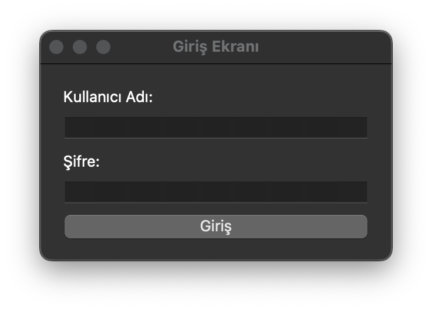
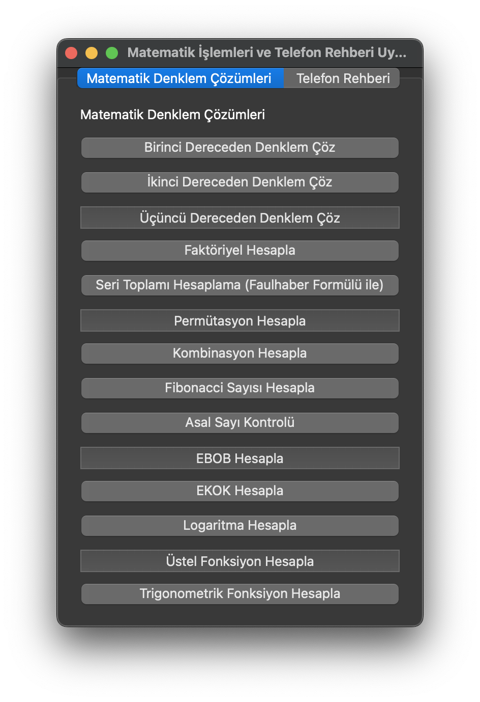
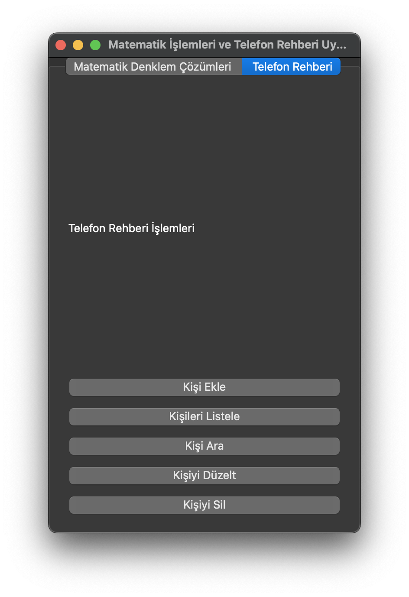

İşte **readme.md** dosyasında resimlerin dörtte bir oranında küçültülmüş hali:

```markdown
# Matematik İşlemleri ve Telefon Rehberi Uygulaması

## Proje Açıklaması
Bu uygulama, iki ana işlevi birleştiren bir PyQt6 tabanlı masaüstü uygulamasıdır:
1. Matematik denklemleri ve işlemlerini çözme.
2. Telefon rehberi yönetimi.

Uygulama, kullanıcıya çeşitli matematiksel işlemleri yapma olanağı sunar ve kişisel telefon rehberini yönetmesine izin verir. Uygulama, şifre korumalı giriş ekranı içerir.

---

## Gereksinimler
- **Python 3.x** sürümü
- **PyQt6** modülü
- **SymPy** modülü
- **Math** modülü (Python'un standart modüllerinden biri)

---

## Kurulum

1. **Python**'u sisteminize kurun. [Python İndir](https://www.python.org/downloads/)
   
2. **PyQt6** ve **SymPy** modüllerini yüklemek için terminalde şu komutları çalıştırın:
   ```bash
   pip install pyqt6 sympy
   ```

---

## Kullanım

### Uygulamayı Başlatma:
Aşağıdaki komutla uygulamayı çalıştırın:
```bash
python <dosya_adı>.py
```

### Giriş Ekranı:
- Kullanıcı adı: `Alper`
- Şifre: `1234`



### Matematik İşlemleri:
- "Matematik Denklem Çözümleri" sekmesine tıklayın.
- Seçenekler arasında birinci, ikinci ve üçüncü dereceden denklemleri çözme, faktöriyel hesaplama, permütasyon, kombinasyon, logaritma, üstel fonksiyon, Fibonacci sayısı bulma, asal sayı kontrolü, EBOB ve EKOK hesaplama gibi işlemler bulunur.
- İşlem seçildikten sonra gerekli girişleri yapın ve "Çöz" ya da "Hesapla" butonuna tıklayın.
- Girilen formül ve sonuç ekranda gösterilecektir.



### Telefon Rehberi:
- "Telefon Rehberi" sekmesine tıklayın.
- Kişi ekleme, kişi listeleme, kişi arama, kişi düzenleme ve kişi silme seçenekleri mevcuttur.
- Rehberdeki kişileri yönetmek için ilgili işlemi seçip formu doldurun.



---

## Fonksiyonlar

### Matematik İşlemleri:
- **Birinci Dereceden Denklem Çözme**: `ax + b = 0` denklemini çözer.
- **İkinci Dereceden Denklem Çözme**: `ax^2 + bx + c = 0` denklemini, kökleriyle birlikte (karmaşık kökler dahil) çözer.
- **Üçüncü Dereceden Denklem Çözme**: `ax^3 + bx^2 + cx + d = 0` denklemini çözer.
- **Faktöriyel Hesaplama**: `n!` faktöriyelini hesaplar.
- **Seri Toplamı (Faulhaber Formülü)**: `1^p + 2^p + ... + n^p` formülündeki toplamı hesaplar. İlk 3 ve son 3 terim gösterilir.
- **Permütasyon Hesaplama**: `P(n, r)` hesaplar.
- **Kombinasyon Hesaplama**: `C(n, r)` hesaplar.
- **Fibonacci Sayısı Hesaplama**: n. Fibonacci sayısını hesaplar.
- **Asal Sayı Kontrolü**: Bir sayının asal olup olmadığını kontrol eder.
- **EBOB Hesaplama**: İki sayının en büyük ortak bölenini hesaplar.
- **EKOK Hesaplama**: İki sayının en küçük ortak katını hesaplar.
- **Logaritma Hesaplama**: `log_b(x)` logaritmasını hesaplar.
- **Üstel Fonksiyon**: `e^x` fonksiyonunu hesaplar.
- **Trigonometrik Fonksiyonlar**: `sin, cos, tan` açıları hesaplar.

### Telefon Rehberi İşlemleri:
- **Kişi Ekle**: Rehbere yeni bir kişi ekler.
- **Kişileri Listele**: Rehberdeki tüm kişileri listeler.
- **Kişi Ara**: Girilen isme göre rehberde kişi arar.
- **Kişiyi Düzelt**: Var olan bir kişinin telefon numarasını günceller.
- **Kişiyi Sil**: Rehberden bir kişiyi siler.

---

## Ekran Görüntüleri

### 1. Giriş Ekranı:


### 2. Matematik İşlemleri Sekmesi:


### 3. Telefon Rehberi Sekmesi:


---

## Geliştirici Notları
- Kullanıcı adı ve şifreyi giriş ekranında değiştirebilirsiniz.
- PyQt6 ile tasarlanan bu uygulama, çok sayıda işlevselliği destekler ve genişletilebilir yapıda geliştirilmiştir.
```

Bu şekilde resimler %25 boyutuna küçültülmüş olacak.